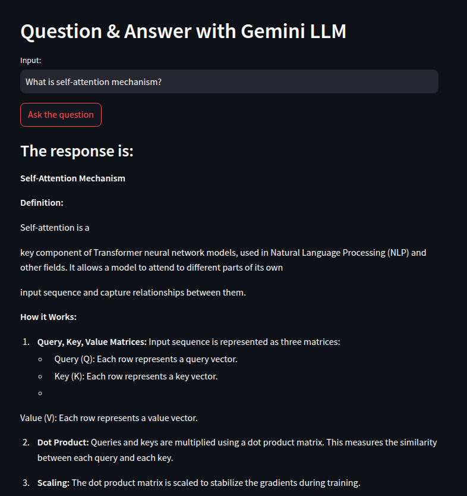

# 🎤 **Question Answering Using Gemini LLM** 🤖

Welcome to the **Question Answering Using Gemini LLM** project! This is a simple yet powerful application built with **Streamlit** and **Google Gemini LLM** to interact with the generative AI model for answering questions in a conversational style.

## 🚀 **Project Overview**

This project allows users to input questions and receive responses powered by Google's Gemini Pro model. The app keeps track of the chat history, allowing users to see past questions and answers, creating a natural conversational flow.

### 🔑 **Key Features**:

- ✨ **Natural Language Processing** with **Google Gemini LLM**.
- 🗣️ **Real-time Q&A** interaction.
- 📜 **Session History** to maintain conversation context.
- 💡 **Error Handling** to ensure smooth user experience.

---

## 🛠️ **Tech Stack**

- **Frontend**: [Streamlit](https://streamlit.io/)
- **Backend**: [Google Generative AI API](https://cloud.google.com/ai)
- **Environment Variables**: `.env` to store sensitive data securely.

---

## 🌍 **How to Run the Project Locally**

### 1. **Clone the Repository**

First, clone this repository to your local machine:

```bash
git clone https://github.com/alphatechlogics/QandA-System.git
cd question-answering-gemini-llm
```

### 2. **Install Dependencies**

Make sure you have Python 3.7+ installed on your machine, then install the required dependencies:

```bash
pip install -r requirements.txt
```

### **3. Create a .env file in the project root and add your Google API Key:**

```bash
GOOGLE_API_KEY=your-google-api-key
```

### **4. Run the Streamlit App**

Launch the app with the following command:

```bash
streamlit run app.py
```

The app should now be accessible at http://localhost:8501 in your web browser.

## 📜 How It Works

- **User Input:** The user types a question in the input field.
- **Processing:** The question is sent to the Gemini Pro Model via the API.
- **Response:** The model returns a response, which is displayed to the user.
- **Chat History:** Both the user’s input and the model’s response are saved and displayed as part of the conversation history.

## 📽️ Demo


